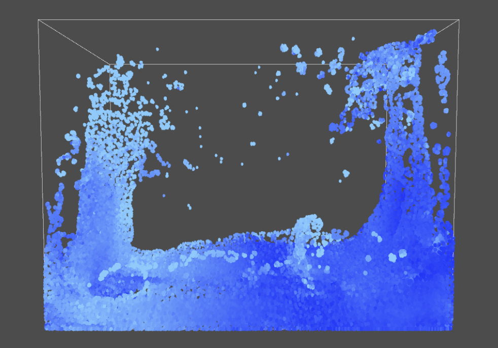
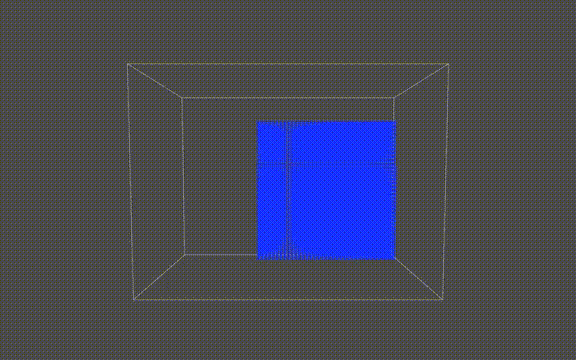
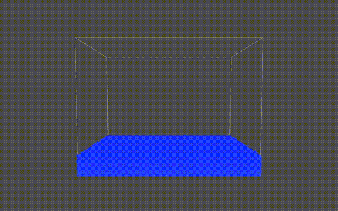

# Particle Fluid Simulation — Smooth-Particle Hydrodynamics on the GPU

A real-time 2D and 3D fluid simulator built in C++ and OpenGL, implementing **Predictive-Corrective Incompressible SPH (PCI-SPH)** entirely on the GPU via GLSL compute shaders. Thousands of particles interact under pressure, viscosity, gravity, and user-applied forces — all running at interactive frame rates.

---



---

## Overview

SPH (Smoothed Particle Hydrodynamics) is a mesh-free method for simulating fluids by treating them as a collection of interacting particles. Each particle carries physical quantities like density and pressure, and forces are computed by summing weighted contributions from neighboring particles within a smoothing radius.

The challenge with standard SPH is maintaining **incompressibility** — real fluids don't compress, but keeping density fluctuations small typically requires either tiny time steps (WCSPH) or solving expensive pressure Poisson equations (ISPH).

**PCI-SPH**, introduced by Solenthaler & Pajarola (University of Zurich), solves this elegantly: rather than reacting to density errors after the fact, it *predicts* future particle positions and iteratively corrects pressure until the density error falls below a threshold. This allows for large time steps without sacrificing physical accuracy.

This project implements PCI-SPH in both 2D and 3D, with every physics step dispatched as a compute shader workgroup on the GPU — no CPU-side particle loops.

---

## Features

- **Full GPU simulation** — all physics computed via GLSL compute shaders using OpenGL SSBOs (Shader Storage Buffer Objects)
- **2D and 3D modes** — independent executables for each, with mode-appropriate rendering
- **PCI-SPH pressure solver** — iterative density correction with configurable convergence threshold and max iterations
- **Interactive mouse forces** — left-click to push, right-click to attract particles in real time
- **Obstacle rendering** — toggle a solid obstacle in the fluid domain
- **Particle reset** — reinitialize all particles to a grid without restarting the program
- **Pause / resume** — hit spacebar to freeze the simulation at any frame

---


---

## Physics Pipeline

Each simulation step runs the following compute shader passes in sequence:

```
1. Apply External Forces     →  gravity + mouse forces → update velocity
2. Compute Densities         →  predict positions, estimate density per particle
   └─ PCI-SPH loop:
      ├─ Compute density error vs. rest density
      ├─ Accumulate pressure correction
      └─ Apply pressure forces → repeat until converged
3. Apply Viscosity           →  smooth velocity field across neighbors
4. Resolve Collisions        →  boundary checks and elastic collision response
```

Pressure correction uses the kernel gradient formulation from the original PCI-SPH paper. The smoothing kernel is a standard poly6-style function; its gradient drives the pressure force computation between particle pairs.

---



---

## Project Structure

```
particle-fluid-sim/
│
├── 2D_SPH.cpp              # Entry point for 2D simulation (GLUT + OpenGL setup)
├── 3D_SPH.cpp              # Entry point for 3D simulation
│
├── PARTICLE_2D.h / .cpp    # 2D sim class: init, compute, render, interaction
├── PARTICLE_3D.h / .cpp    # 3D sim class
├── SHADER.h / .cpp         # Shader loading and compute shader creation utilities
├── SETTINGS.h              # Shared vec2/vec3 math types and GL includes
├── SPHERE.h                # Sphere geometry helper (3D)
│
├── compute2d/              # GLSL compute shaders for 2D physics
│   ├── 2D_extForces.glsl
│   ├── 2D_computeDensities.glsl
│   ├── 2D_applyPressures.glsl
│   ├── 2D_viscosity.glsl
│   └── 2D_resolveCollisions.glsl
│
├── compute3d/              # GLSL compute shaders for 3D physics
│   ├── extForces.glsl
│   ├── computeDensities.glsl
│   ├── applyPressures.glsl
│   ├── viscosity.glsl
│   └── resolveCollisions.glsl
│
├── render2d/               # Vertex + fragment shaders for 2D rendering
├── render3d/               # Vertex + fragment shaders for 3D rendering
│
├── archive/                # Earlier CPU-only SPH prototype (reference)
└── Makefile.linux
```

---

## Dependencies

| Library         | Purpose                       |
| --------------- | ----------------------------- |
| OpenGL 4.3+     | Compute shaders, SSBO support |
| GLEW            | OpenGL extension loading      |
| GLUT / freeglut | Window and input management   |
| GLM             | Matrix math for 3D rendering  |

On Ubuntu/Debian:

```bash
sudo apt install libglew-dev freeglut3-dev libglm-dev
```

---

## Building

```bash
# Build both 2D and 3D executables
make -f Makefile.linux

# Or build individually
make -f Makefile.linux 2D_SPH
make -f Makefile.linux 3D_SPH
```

Compiled with `g++ -O3`. Requires a GPU and driver supporting **OpenGL 4.3 core profile**.

---

## Running

```bash
./2D_SPH    # Launch 2D simulation (1024×768 window, 10,000 particles)
./3D_SPH    # Launch 3D simulation (1440×900 window)
```

### Controls

| Input                  | Action                          |
| ---------------------- | ------------------------------- |
| `Space`              | Pause / resume simulation       |
| `Left click + drag`  | Push particles away from cursor |
| `Right click + drag` | Pull particles toward cursor    |
| `O`                  | Toggle obstacle visibility      |
| `R`                  | Reset particles to initial grid |
| `Q`                  | Quit                            |

---

## Parameters

Key simulation parameters are set in `PARTICLE_2D.h` / `PARTICLE_3D.h` and passed as uniforms to the compute shaders:

| Parameter             | Default (2D) | Description                       |
| --------------------- | ------------ | --------------------------------- |
| `numParticles`      | 10,000       | Total particle count              |
| `dt`                | 1/60 s       | Timestep                          |
| `smoothingRadius`   | 40 px        | SPH kernel support radius         |
| `restDensity`       | 0.02         | Target incompressible density     |
| `viscosityStrength` | 0.9          | Velocity smoothing coefficient    |
| `mouseStrength`     | 3000         | Force magnitude from cursor       |
| `maxIterations`     | 8            | Max PCI-SPH correction iterations |

---

## Background: Why PCI-SPH?

Standard weakly compressible SPH (WCSPH) controls compressibility through a stiff equation of state, which forces very small time steps — the simulation becomes slow for large particle counts or high accuracy requirements. Incompressible SPH (ISPH) solves a Poisson equation each frame, which is more stable but computationally heavy and harder to implement on unstructured particle configurations.

PCI-SPH sits between the two: it predicts density deviations before they happen and propagates corrections through the fluid in a tight inner loop (typically 3–4 iterations in practice). The original paper reports **15–55× speedup** over WCSPH depending on the target density error threshold, with visually identical results.

The GPU implementation here takes this further — each iteration of the correction loop is a compute shader dispatch, so the per-particle work is fully parallelized with no CPU roundtrips during the physics update.

---




## Reference

> Solenthaler, B., & Pajarola, R. (2009).
> *Predictive-corrective incompressible SPH.*
> ACM Transactions on Graphics (SIGGRAPH 2009), 28(3), Article 40.

---
